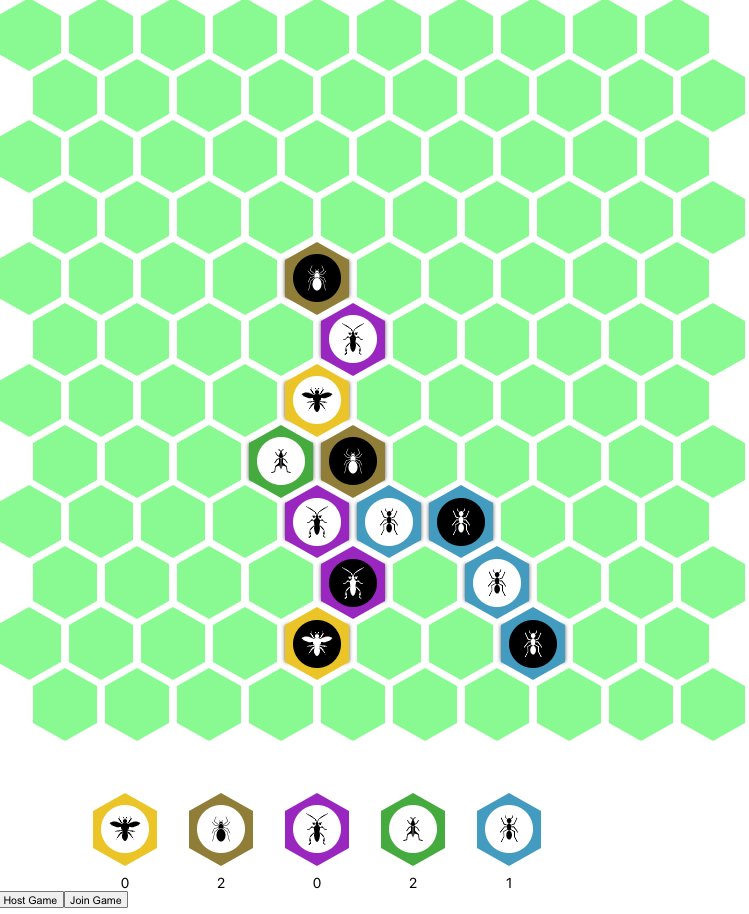
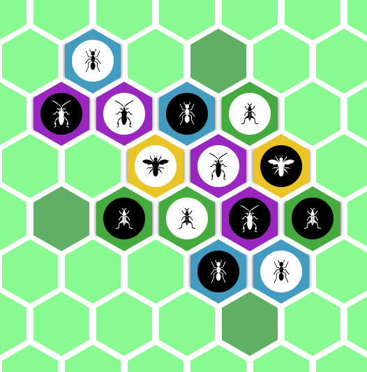

# Queen Bee

A clone of the board game Hive, a hexagonal tile-based insect-themed strategy game.

## About the game

The game takes place on an infinite hexagonal board. Players place insects, each with different movement restrictions:

* The queen bee can move one space per turn.
* Spiders can move exactly three spaces per turn.
* Beetles can move one space per turn, but can climb on other insects.
* Grasshoppers can jump in a straight line over other insects to a free space on the other side.
* Ants can move unlimited spaces as long as they are connected to the hive.
* All insects must keep the hive intact during and after their turn.

## About the project

Given the complex movement mechanics, I thought it would be fun to essentially build a "valid move" calculator for this game.

For example, the image above shows valid moves that can be made by the black grasshopper on the far right.

The move calculator takes into account the movement restrictions of the insect in question, as well as whether a move will break the hive (making it non legal - essentially we check for graph connectivity!).

It turns out that once you've made a legal move calculator for a game, you've basically made the game, so I fleshed this out into a fully playable local 2 player game, and then added basic online connectivity as well (host + join a game, you'll need to host a server yourself).

## Running it locally

Clone the repo, then:

`yarn start`

in the main folder, then:

`cd server && yarn start`

in the server folder.

## Known issues

* The valid-move calculator is not perfect - some ant moves are considered illegal when they're legal and vice versa (mostly around )
* In the online version, you can actually make moves as either player. The game works if you wait for the opponent to move instead of moving for them though ;)
* Currently only works on localhost because of CORS stuff, will fix this soon
* Currently doesn't check for the win condition
* Currently doesn't check for the condition that you can only place insects
* Currently doesn't check for the condition that you must place the queen bee within the first four turns
* Codebase is a bit ravioli (seen worse but definitely not too shiny)

More on the game rules here: https://en.wikipedia.org/wiki/Hive_(game)